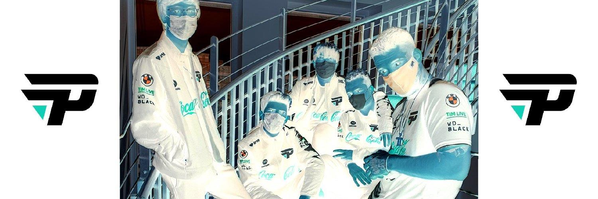
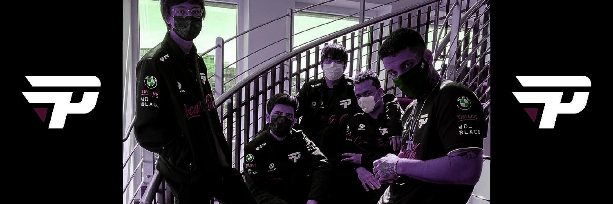

# sharprocessing
Uma biblioteca de processamento digital de imagens para C# em construção.

## Features

A seguir as features demonstradas sobre essa imagem de exemplo:


### Processamento Pixel-a-Pixel

```
using Flow.Image;
using Flow.Image.Processing;

Picture pic = Picture
    .New("paingaming.jpg")
    .ForPixel((r, g, b) => (255 - r, 255 - g, 255 - b));

pic.Save("negativepng.jpg");
```


```
using Flow.Image;
using Flow.Image.Processing;

Picture pic = Picture
    .New("paingaming.jpg")
    .ForPixel(p => p > 155 ? 255 : 0); //Grayscale automático

pic.Save("gstreshold.jpg");
```


```
using Flow.Image;
using Flow.Image.Processing;

Picture pic = Picture
    .New("paingaming.jpg")
    .ForPixel((r, g, b) => (r * g / 255, g * b / 255, b * r / 255)) //Multiplos processamentos
    .ForPixel((r, g, b) => (b, g, r));

pic.Save("multiprocesspng.jpg");
```


## TODO

 - Tratar exceções adequadamente
 - Acrescentar documentação
 - Add README.md in english language
 - Finalizar todas as implementações de operação pixel-a-pixel
 - Implementar Integral de imagens
 - Implementar método Copy para imagens
 - Implementar BlurBox
 - Implementar convolução de imagens