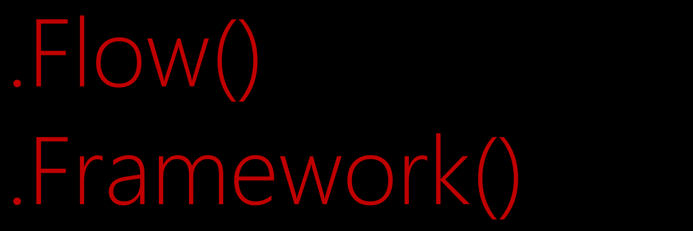

# dotflow

Uma biblioteca de processamento digital de sinais para C# em construção.

## Feature

 - Abra e Salve imagens
 - Processe a image pixel a pixel
 - Veja a imagem processada
 - Processe direto da Webcam
 - Abra e Salve áudios em .wav
 - Proesse amostra a amostra

## TODO

 - Tratar exceções adequadamente (50%)
 - Acrescentar documentação
 - Add README.md in english language
 - Finalizar todas as implementações de operação pixel-a-pixel (50%)
 - Implementar Integral de imagens
 - Implementar método Copy para imagens
 - Implementar BlurBox
 - Implementar convolução de imagens
 - Implementar mais codecs de áudio
 - Implementar processamento de sinais genérico
 - Corrigir README.md para as novas versões